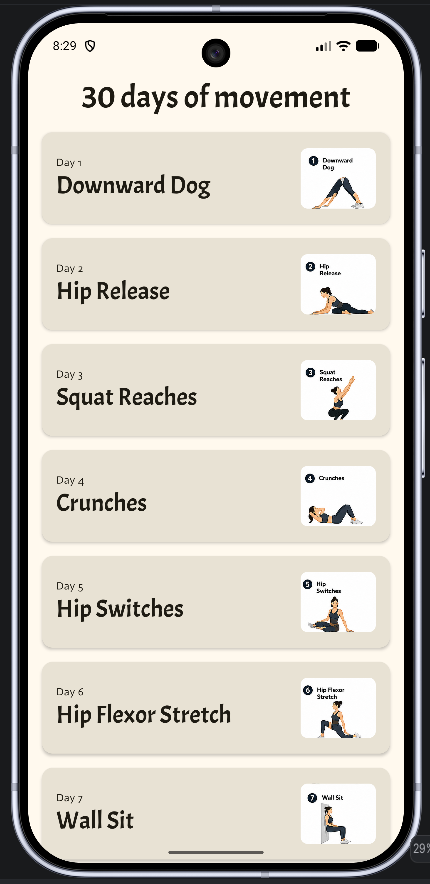
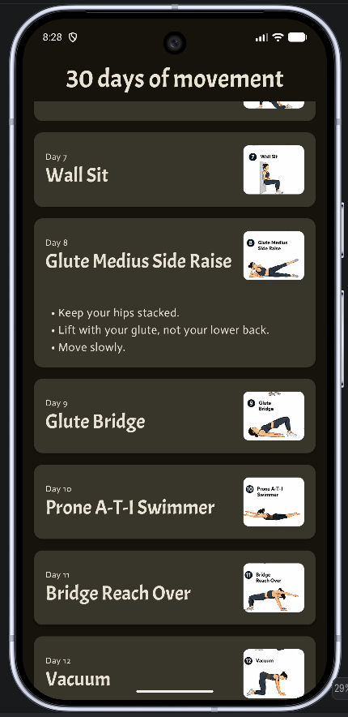

# 30 Days of Movement

A simple Android app built with **Jetpack Compose** that guides users through **30 different mobility and strength exercises**. Each day presents a movement with an illustration and a list of cues to help perform the exercise correctly.

This project was created as part of my journey learning modern Android development with Kotlin and Jetpack Compose.

## Features

- 📅 30 unique daily movements
- 🖼️ Exercise illustration for every movement
- 📖 Expandable cards with movement cues
- 🎨 Material 3 design
- 📱 Built entirely with Jetpack Compose
- 🌙 Light and Dark theme previews

## Screenshots

| Light Theme                      | Dark Theme                      |
|----------------------------------|---------------------------------|
|  |  |

## Tech Stack

- Kotlin
- Jetpack Compose
- Material 3
- Android Studio
- Resource-based localization (strings, arrays, drawables)

## Project Structure

```
model/
    Movement.kt
    MovementsRepository.kt

ui/
    theme/

MovementScreen.kt
```

## What I Learned

During this project I practiced:

- Building reusable composables
- State management with `remember` and `mutableStateOf`
- Working with `LazyColumn`
- Animating layouts using `animateContentSize`
- Using Android resource files (`strings.xml`, `arrays.xml`, drawables)
- Organizing data with repositories and data classes
- Material 3 theming
- Creating responsive layouts with `Modifier`

## Future Improvements

- ✅ Mark movements as completed
- 📆 Daily reminder notifications
- 💾 Save progress with DataStore
- 🔍 Search and filter exercises
- ❤️ Favorite movements
- 🎥 Link to demonstration videos
- ⏱️ Built-in timer for exercises

## Getting Started

1. Clone the repository

```bash
git clone https://github.com/markhristov/30DaysOfMovement.git
```

2. Open the project in Android Studio.

3. Build and run on an emulator or Android device running Android 7.0 (API 24) or higher.

## License

This project is for educational purposes.